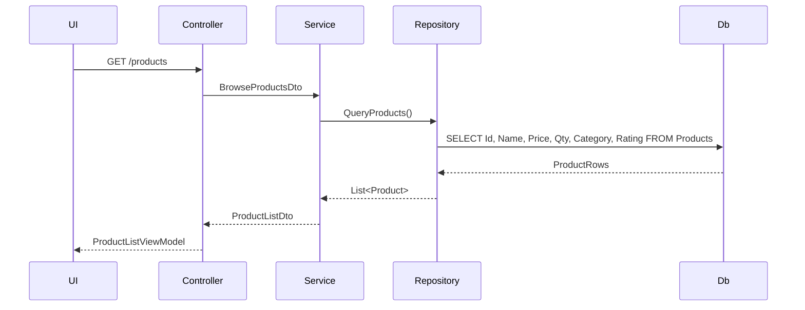
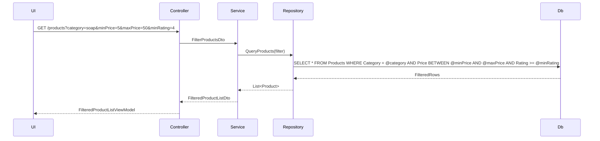
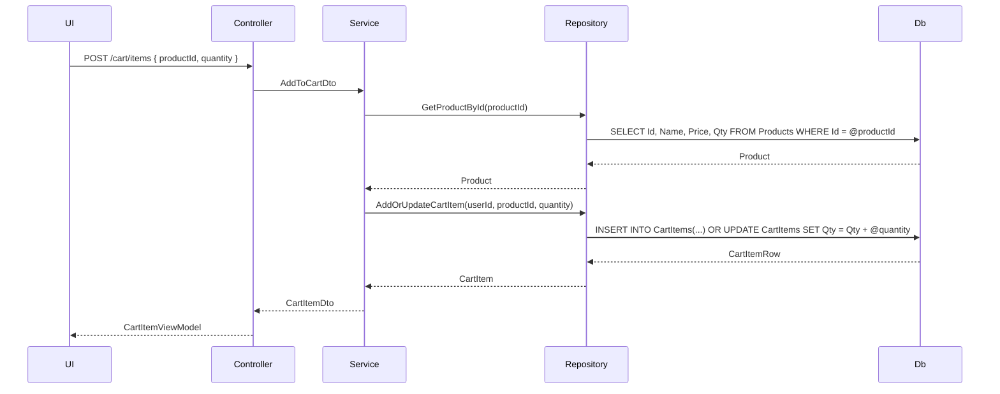

# Feature: A product page that allows a user to filter, view, and add products to a cart.

## User Actions
- View the list of products
- Filter products by category, price, rating
- Add a product to the cart

## User Story

### View Products: As a user I want to view available products so that I can browse the inventory.

    
View Sequence

### Filter Products: As a user I want to filter products by category, price, and rating so that I can find relevant items quickly.

    
Filter Sequence

### Add Products to a Cart: As a user I want to add a product to my cart so that I can purchase it later.

    
Add Product Sequence

